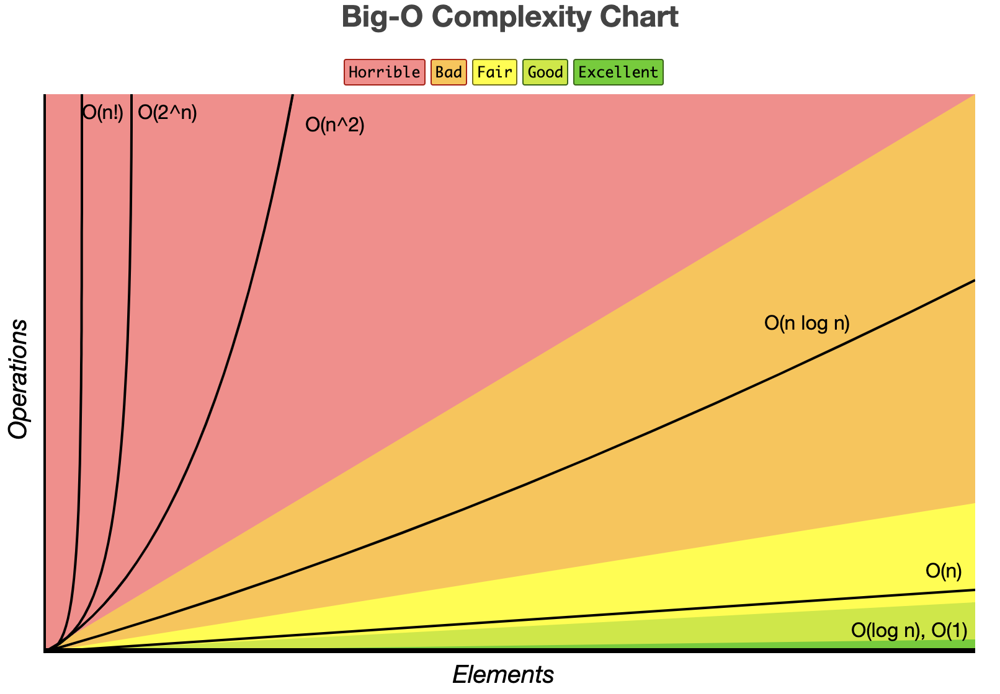

# Computer science fundamentals

## Algorithms and Data Structures

## Data Structures

- ### Stack - LIFO (Last In First Out)
  - **peek()**: see the very top element or node of the Stack
  - **push(value)**: add a node (or element to the top of the Stack
  - **pop()**: remove an element or node from the top of the Stack
  - **isEmpty()**: check if Stack is empty
- ### Queue - FIFO (First In First Out)

  - **peek()**: get the very fist element or node in the Queue
  - **enqueue(value)**: add a node or element to the Queue
  - **dequeue()**: remove an element or node from the Queue
  - **isEmpty()**: check if the Queue is empty

- ### Trees

  - #### Binary Search Tree (Balanced)
    - **lookup**: O(log N)
    - **insert**: O(log N)
    - **delete**: O(log N)
  - #### Binary Search Tree (Unbalanced)
    - **lookup**: O(N)
    - **insert**: O(N)
    - **delete**: O(N)

- ### Graphs

---

## Algorithms

- Sorting
- Dynamic Programming
- BFS + DFS (Searching)
- Recursion

**Anatomy of recursion**

- 1- Identify the base case
- 2- Identify the recursive case
- 3- Get closer and closer and return when needed. Usually you have 2 returns (1 for the base case and 1 for the recursive case).

**Sorting**
What sorting algorithm to choose based on the problem?
How to make the right decision?

- Bubble Sort
- Insertion Sort
- Selection Sort
- Merge Sort
- Quick Sort

---

## Big Os

**O(1)** Constant - no loops
**O(log N)** Logarithmic - usually searching algorithms have log(n) if they are sorted (Binary Search)
**O(N)** Linear - for loops while loops

### Big-O Complexity Chart

